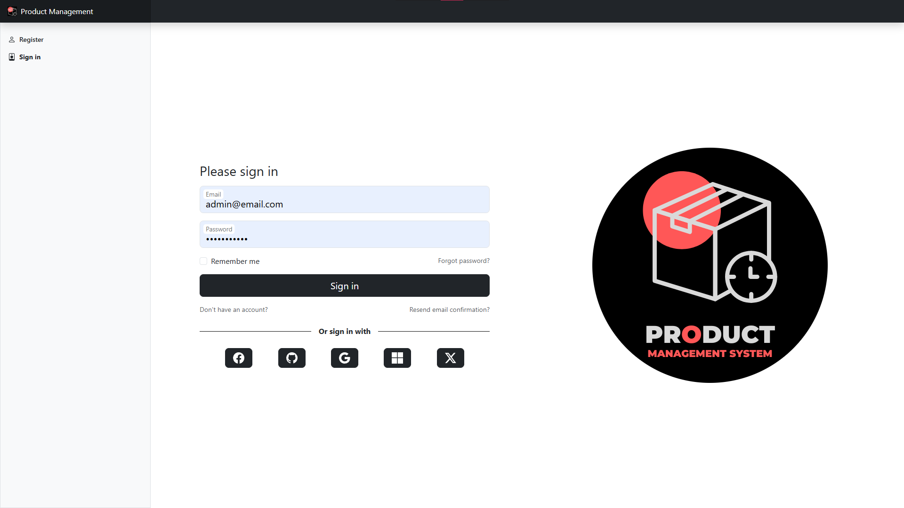
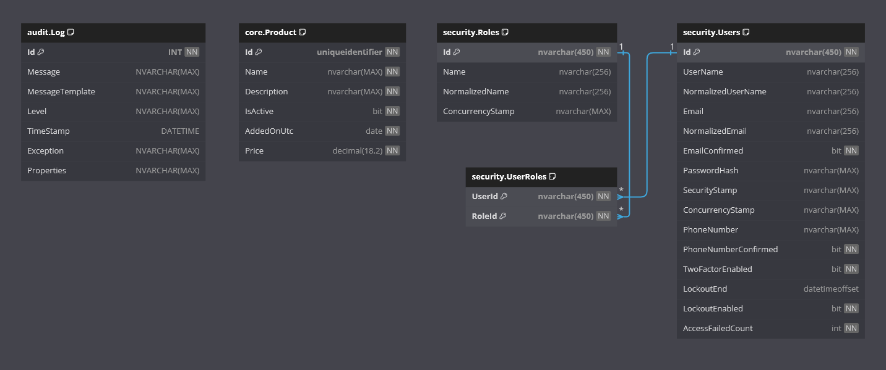

    
    <h1>Product Management System</h1>

Welcome to the **Product Management** System!

This is a .NET project designed to demonstrate role based authentication and authorisation with ASP.NET Core Identity.

Product Management System is a back-of-store application developed solely using .NET!
Users can create, view, update and delete products. Whilst admins can create, view, update and delete users. Owners have full controls, and account with no role will just be able to see the home page.

The web front-end is delivered by a Blazor Web App and utilises Boostrap for styling.
There is an integrated SQL Server database in the back-end.

## Features

- **Blazor**:
  - The web front end has been built with Blazor Web App v9.
- **Bootstrap**:
  - The web UI is styled using Bootstrap v5.3.3.
- **Products**:
  - Users can create, view, update and delete products. Search, ordering and pagination has been implemented.
- **Users**:
  - Admins can create, view, update and delete users. Search, ordering and pagination has been implemented.
- **Account**:
  - New users can register themselves, or an Admin can create them. However, to log in they must first confirm their email. Authenticated users can update their email or set/change their password.
- **Email Integration**:
  - Email confirmations, change of emails, and password resets are all handled via a link send via email.
- **Error Logging**:
  - Any application errors are written to a database audit table.
- **Entity Framework Core**:
  - Entity Framework Core is used as the ORM.
- **SQL Server**:
  - SQL Server is used as the data provider.
- **Responsive Web Design**:
  - A user-friendly web interface has been designed to work on various devices.

## Technologies

- .NET
- Blazor
- Bootstrap
- HTML
- CSS
- ASP.NET Core Identity
- Entity Framework Core
- SQL Server

## Getting Started

**IMPORTANT NOTE**:

The `InitialCreate` database migration has been created.

On start-up of the **BlazorApp** application, any required database creation/migrations will be performed.

### Prerequisites

- .NET 9 SDK.
- An IDE (code editor) like Visual Studio or Visual Studio Code.
- A database management tool (optional).

### Installation

1. Clone the repository:

   - `git clone https://github.com/chrisjamiecarter/product-management-system.git`

2. Navigate to the Web project directory:

   - `cd src\ProductManagement.BlazorApp`

3. Configure the application:

   - Update any required settings in `appsettings.json` to target your environment:
     - ConnectionStrings
       - ProductManagement: Required to target database.
     - EmailOptions
       - SmtpHost: Your email client host.
       - SmtpPort: Your email client port.
       - SmtpUser: Your email client username.
       - SmtpPassword: Your email client password.
       - FromName: The display name that emails will be sent from.
       - FromEmailAddress: The email address that emails will be sent from.
     - Logging
       - LogLevel: Define any custom logging requirements.
     - SeederOptions:
       - SeedDatabase: Set to true to seed database, false will not seed database.
       - SeedUsers: Define Email and Role of users to be seeded.
       - Password Generation Format:
            - When seeding users, passwords are automatically generated using the following format:
                - Take the portion of the email before the @ symbol.
                - Capitalize the first letter, with the rest in lowercase.
                - Append 123### to the end.
            - Example:
                - For the email `user@email.com`, the generated password will be: `User123###`

4. Build the application using the .NET CLI:

   - `dotnet build`

### Running the Application

1. You can run the `BlazorApp` application from Visual Studio.

NOTE: If you run from Visual Studio, the application may catch a `Microsoft.AspNetCore.Components.NavigationException` exception. Un-check `Break when this exception type is user-unhandled`

OR

1. Run the `BlazorApp` application using the .NET CLI in the Web project directory:

   - `cd src\ProductManagement.BlazorApp`
   - `dotnet run`

2. Navigate to `https://localhost:7128` on your choice of web browser.

## Usage

Please refer to the short YouTube video demonstration below:

## How It Works

- **Web Project**: This project uses Blazor Web App v9 to serve .NET pages to your web browser. Interactive render mode provides interactability.
- **Web Design**: This project uses Bootstrap v5.3.3 to style the app and provide a responsive web design.
- **Authentication and Authorization**: This project uses ASP.NET Core Identity to secure the app.
- **MediatR**: MediatR is used to send and handle commands and queries within the application.
- **Seeding**: Bogus is used to generate fake product data for the database.
- **Logging**: Serilog and it's MsSqlServer Sink is used to write log messages to the database.
- **Data Storage**: A new SQL Server database is created and the required schema is set up at run-time, or an existing database is used if previously created.
- **Data Access**: Interaction with the database is via Entity Framework Core.

## Project Architecture

This project follows the **Clean Architecture** principles combined with the **Command Query Responsibility Segregation (CQRS)** pattern. By following these architectural patterns, the project remains modular, testable, and adaptable to future changes.

### Clean Architecture

The solution is structured to enforce separation of concerns, making the codebase more maintainable, scalable, and testable. It consists of four main distinct layers:

- Domain Layer: Contains the core business logic and domain entities, independent of external frameworks.
- Application Layer: Implements use cases and CQRS handlers, providing a clear separation between commands (modifications) and queries (retrieval).
- Infrastructure Layer: Handles external concerns such as database access, authentication, email and third-party integrations.
- Presentation Layer: Provides the user interface, built with Blazor, and interacts with the application layer via MediatR requests.

### CQRS

The CQRS pattern is applied to separate read and write operations. Commands handle data modifications, while queries retrieve data efficiently. This improves performance, scalability, and maintainability, especially when combined with Clean Architecture.

## Database

## Version

This document applies to the ProductManagementSystem v1.0.0 release version.

## Contributing

Contributions are welcome! Please fork the repository and create a pull request with your changes. For major changes, please open an issue first to discuss what you would like to change.

## License

This project is licensed under the MIT License. See the [LICENSE](./LICENSE) file for details.

## Contact

For any questions or feedback, please open an issue.

---

**_Happy Product Managing!_**
